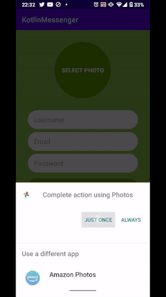
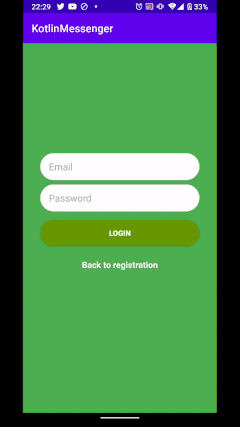

# KotlinMessenger
 Pratice Android Application that features a fully functional chat messaging environment.
 
## User to User messaging
To send and receive messages the app saves a list of messages under a node in Firebase Database.  Next, it listens for all these messages as they are entered in the system, and then refreshes the adapter items in real time.



```
private fun performSendMessage() {

        //Get sender info
        val text = edittext_chat_log.text.toString()
        val fromId = FirebaseAuth.getInstance().uid

        //Get receiver info
        val user = intent.getParcelableExtra<User>(NewMessageActivity.USER_KEY)
        val toId = user?.uid

        if (fromId == null) return

        //Push messages to each user message's list on the RealTimeDatabase
        val reference =
            FirebaseDatabase.getInstance().getReference("/user-messages/$fromId/$toId").push()

        val toReference =
            FirebaseDatabase.getInstance().getReference("/user-messages/$toId/$fromId").push()

        val chatMessage =
            ChatMessage(reference.key!!, text, fromId, toId!!, System.currentTimeMillis() / 1000)
        reference.setValue(chatMessage)

            .addOnSuccessListener {
                Log.d(TAG, "Saved chat message: ${reference.key}")
                edittext_chat_log.text.clear()
                recyclerview_chat_log.scrollToPosition(adapter.itemCount - 1)
            }
        toReference.setValue(chatMessage)

        //Update Latest message to the recently uploaded message
        val latestMessageRef =
            FirebaseDatabase.getInstance().getReference("/latest-messages/$fromId/$toId")
        latestMessageRef.setValue(chatMessage)

        val latestMessageToRef =
            FirebaseDatabase.getInstance().getReference("/latest-messages/$toId/$fromId")
        latestMessageToRef.setValue(chatMessage)

    }
```
 
### Latest Messages
The initial activity displays a list of users whom the currently logged user is messaging. Each adapter's item also fetches the information from a specific Firebase node that monitors the latest messages saved.

```
private fun listenForLatestMessages() {
        val fromId = FirebaseAuth.getInstance().uid
        val ref = FirebaseDatabase.getInstance().getReference("/latest-messages/$fromId")

        //Fetch Latest Messages for each active conversation
        ref.addChildEventListener(object : ChildEventListener {

            override fun onChildAdded(p0: DataSnapshot, p1: String?) {
                val chatMessage = p0.getValue(ChatMessage::class.java) ?: return
                latestMessagesMap[p0.key!!] = chatMessage
                refreshRecyclerViewMessages()

            }

            override fun onChildChanged(p0: DataSnapshot, p1: String?) {
                val chatMessage = p0.getValue(ChatMessage::class.java) ?: return
                latestMessagesMap[p0.key!!] = chatMessage
                refreshRecyclerViewMessages()
            }

            override fun onCancelled(error: DatabaseError) {

            }

            override fun onChildMoved(snapshot: DataSnapshot, previousChildName: String?) {

            }

            override fun onChildRemoved(snapshot: DataSnapshot) {

            }
        })
    }
```

## Firebase Auth
Using the Firebase Auth library users can be registered with email and password. They can create a username and upload a profile picture.
Integrating CircleImageView allows to round off the corners of the images



## RecyclerView
Using [Groupie library](https://github.com/lisawray/groupie) for easier adapter object creation.

```
//ViewHolder Class for outbound messages
        class ChatFromItem(val text: String, val user: User) : Item<GroupieViewHolder>() {
            override fun bind(viewHolder: GroupieViewHolder, position: Int) {
                viewHolder.itemView.textView_from_row.text = text

                val uri = user.profileImageUrl
                val targetImageView = viewHolder.itemView.imageView_from_row
                Picasso.get().load(uri).into(targetImageView)

            }

            override fun getLayout(): Int {
                return R.layout.chat_from_row
    }
}
```
